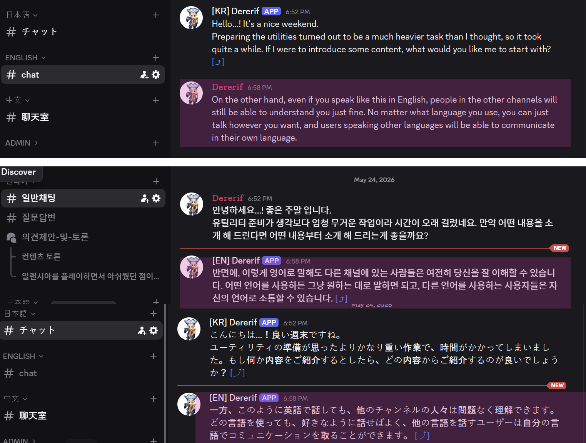

# Hamoni



Real-time Discord chat translation relay between Korean / English / Japanese / Chinese channels. LLM-powered, latency-optimized, MMORPG-tuned.

---

## Features

- Automatic translation and relay across 4 language channels (KR / EN / JP / CN)
- **Two-layer translation cache** — in-memory LRU (100K entries, instant) + persistent SQLite (30-day TTL, survives restarts). Most repeated phrases return in 0 ms with no API cost
- **Subject-aware translation rules** — Korean/Japanese omit subjects in chat; the prompt detects honorific endings, self-reflection markers, and game-context signals to avoid the classic "you" misattribution
- **Custom glossary** — game-specific proper nouns (game name, locations, classes, items) are replaced with opaque placeholders before the LLM call and restored to canonical target-language forms after. The LLM never sees the term itself, so it can never produce a wrong transliteration (`Erentia` / `Eransia` / etc.). System prompt grows zero as the glossary grows
- Parallel API fan-out (3 target languages per message, all in flight at once)
- Message edit / delete sync, reply context preservation, attachment forwarding
- Mention, custom emoji, and Discord markdown preservation
- Per-user rate limiting (max 5 in-flight messages per user)
- `/stats` slash command (p50 / p95 / p99 latency, cache hit rate, per-pair breakdown)
- Persistent metrics log (JSONL, daily rotation)
- **Multilingual parallel corpus log** — every translated message is stored as a 4-way parallel row in SQLite for offline analysis / future fine-tuning
- **Real-time tail viewer** (`watch_corpus.js`) — live stream of incoming translations, runnable as a PM2 daemon you can attach to and detach from at will

---

# 1. Discord Bot Setup

## 1.1 Create the bot

1. Go to the [Discord Developer Portal](https://discord.com/developers/applications)
2. **New Application** → enter a name (e.g. `Hamoni`) → Create
3. Left menu → **Bot** → **Reset Token** → **copy the token and store it somewhere safe** (shown only once)
4. On the same **Bot** page, scroll to **Privileged Gateway Intents**:
   - ✅ **MESSAGE CONTENT INTENT** (required)
   - The other intents can stay off

## 1.2 Invite the bot to your server

1. Left menu → **OAuth2** → **URL Generator**
2. **SCOPES**: ✅ `bot` ✅ `applications.commands`
3. **BOT PERMISSIONS**:
   - ✅ View Channels
   - ✅ Send Messages
   - ✅ Embed Links
   - ✅ Read Message History
   - ✅ Manage Webhooks
   - ✅ Use Application Commands
4. Open the generated URL, pick the server, confirm, and authorize.

## 1.3 Create channels and copy their IDs

1. In Discord, create 4 channels — one per language (e.g. `#chat-kr`, `#chat-en`, `#chat-jp`, `#chat-cn`).
2. Enable **User Settings → Advanced → Developer Mode**.
3. Right-click each channel → **Copy Channel ID** → save the 4 IDs (used in step 2.5).

---

# 2. Linux Server Installation

Tested on Ubuntu 22.04 / 24.04. Other distros: swap the package manager.

## 2.1 Update the OS and install Node.js

```bash
# Update the OS
sudo apt update && sudo apt upgrade -y

# Install Node.js 20 LTS (official NodeSource script)
curl -fsSL https://deb.nodesource.com/setup_20.x | sudo -E bash -
sudo apt install -y nodejs

# Verify
node --version   # v20.x.x
npm --version
```

## 2.2 Install pm2

```bash
sudo npm install -g pm2
pm2 --version
```

## 2.3 Clone and install Hamoni

```bash
git clone https://github.com/parkbrother86/hamoni.git
cd hamoni
npm install
```

`npm install` will also compile / download a prebuilt `better-sqlite3` binary for the persistent cache layer. If the prebuild step fails on an unusual platform, install the toolchain and retry:

```bash
sudo apt install -y python3 make g++ build-essential
rm -rf node_modules/better-sqlite3
npm install better-sqlite3
```

## 2.4 Configure environment variables

Create `.env`:

```bash
nano .env
```

Contents:

```env
DISCORD_TOKEN=the_bot_token_from_step_1.1
DEEPSEEK_API_KEY=your_deepseek_api_key
```

Get a DeepSeek API key at https://platform.deepseek.com .

## 2.5 Configure channel IDs

Edit `config.js`:

```bash
nano config.js
```

Replace the IDs in `CHANNELS` with the ones you copied in step 1.3:

```js
const CHANNELS = {
  kr: 'YOUR_KR_CHANNEL_ID',
  en: 'YOUR_EN_CHANNEL_ID',
  jp: 'YOUR_JP_CHANNEL_ID',
  cn: 'YOUR_CN_CHANNEL_ID',
};
```

## 2.6 Run with pm2

```bash
# Start
pm2 start index.js --name hamoni

# Check logs to confirm startup
pm2 logs hamoni

# You should see:
# Logged in as <BotName>#XXXX
# kr: #chat-kr <channelId>
# en: #chat-en <channelId>
# jp: #chat-jp <channelId>
# cn: #chat-cn <channelId>
# Slash commands registered on guild ...: /stats
```

## 2.7 Optional: enable the live translation viewer

The watcher is a separate, read-only process that prints every newly translated message in real time. You can attach to and detach from it freely while it keeps running.

```bash
# Register as a daemon (skip the initial backfill — pm2 logs handles that)
pm2 start watch_corpus.js --name hamoni-watcher -- --backfill 0

# Save so it auto-starts on reboot
pm2 save

# Whenever you want to see the live stream:
pm2 logs hamoni-watcher --lines 30
# Ctrl+C in pm2 logs → detach (watcher keeps running)

# To actually stop the viewer:
pm2 stop hamoni-watcher
```

See section 3.7 for details and filtering options.

## 2.8 Auto-start on boot

```bash
pm2 save
pm2 startup
# Then run the sudo command printed by `pm2 startup` to register the systemd unit
```

## Updating the code later

```bash
cd hamoni
git pull
npm install     # dependencies may have changed
pm2 restart hamoni
pm2 logs hamoni --lines 50
```

---

# 3. Using the Bot

## 3.1 Automatic behavior (no configuration needed)

Once the bot is running, any message posted in one of the 4 configured channels is automatically translated and relayed to the other 3. The webhook impersonates the original user's name and avatar so messages look like they were posted by that user.

```
Source (#chat-kr):  alice: 이번 주말 레이드 가능?
                ↓ auto translation
#chat-en:  [KR] alice: Can you join the raid this weekend? [⤴]
#chat-jp:  [KR] alice: 今週末のレイド参加可能? [⤴]
#chat-cn:  [KR] alice: 这周末能参加团本吗? [⤴]
```

The `[⤴]` at the end of each message is a clickable jump link back to the original.

## 3.2 What's handled automatically

| Behavior | Description |
|---|---|
| **Two-layer cache** | Memory LRU (100K entries) + SQLite (30-day TTL). Repeated phrases (`ㅋㅋ`, `GG`, `AFK`, etc.) return instantly with no API call. Survives bot restarts |
| **Key normalization** | `gg`, `gg `, ` gg ` all map to the same cache entry (trim + whitespace-collapse) |
| **API skip** | Emoji-only / URL-only / number-only messages are relayed verbatim, no API call |
| **Same-language detection** | If a Korean channel message is written in English, the EN channel gets it as-is (no API call) |
| **Subject handling** | Korean/Japanese omit subjects; the prompt prefers sentence-fragment translations ("Okay?", "Boss down?") over guessing "you", while preserving honorific signals ("-시-", "ですか") and self-reflection ("-네요", "なぁ") |
| **Glossary substitution** | Terms in `data/glossary.json` are replaced with opaque placeholders before the LLM call and restored to canonical target-language forms after. Guarantees `일랜시아 → Elancia / エランシア / 艾兰西亚` consistently, regardless of model — see 3.9 |
| **Mention preservation** | `<@userId>` is rendered as `@displayname` (no ping); clicking it opens the real user profile |
| **Custom emoji** | `<:emoji:id>` renders correctly across all 4 channels (same guild only) |
| **Markdown** | `**bold**`, `||spoiler||`, ```` ```code blocks``` ```` etc. are preserved verbatim |
| **Attachments** | Images, files, and videos are forwarded automatically (also works for attachment-only messages) |
| **Long messages** | Over 300 chars: the original is relayed with a "message too long to translate" notice instead of being silently dropped |
| **Edit sync** | When the source is edited, all relayed copies are re-translated and updated |
| **Delete sync** | When the source is deleted, all relayed copies are deleted too |
| **Replies** | When you use Discord's reply feature, target channels get a `> quoted snippet` prefix for context |
| **Rate limit** | If a single user has 5+ messages in flight, additional messages are dropped to prevent flooding |
| **Parallel corpus log** | Every translated message is stored as a 4-way parallel row (KR / EN / JP / CN) in SQLite for later analysis — see 3.8 |

## 3.3 Slash commands

### `/stats`

Displays bot operational statistics, visible only to you (ephemeral):

```
Hamoni Bot Stats

Current session
  uptime 2d 14h 32m · rate limit drops 0
  edits 5 · deletes 2

Last 1 hour
  calls 234 · hit rate 38.1% · errors 1
  p50 680ms · p95 1.42s · p99 2.10s · avg 752ms

Last 24 hours
  calls 5891 · hit rate 41.3% · errors 8
  p50 720ms · p95 1.51s · p99 2.34s · avg 810ms

Per-pair p95 (24h, slowest first)
  kr→jp p95 1.62s (n=1430)
  kr→en p95 1.45s (n=1622)
  kr→cn p95 1.22s (n=1411)
  ...
```

- `p50 / p95 / p99`: latency percentiles. p95 = 1.5s means "95% of responses arrive within 1.5 seconds"
- `hit rate`: cache hit ratio. Higher = faster overall. Expect this to climb over the first few hours/days as the cache warms up, then plateau in the 70–95% range depending on chat repetition
- `errors`: failed API calls
- If the slash command doesn't show up: wait 1 minute after a bot restart, and verify the bot has `Use Application Commands` permission

## 3.4 Data layout

The bot writes several files under `data/`:

```
data/
├── metrics-2026-05-23.jsonl          (per-call event log, daily rotation)
├── metrics-2026-05-24.jsonl
├── translation_cache.db              (SQLite: cache L2 + corpus log)
├── translation_cache.db-shm          (SQLite WAL shared memory)
└── translation_cache.db-wal          (SQLite write-ahead log)
```

### `metrics-YYYY-MM-DD.jsonl`

Each line is one API call or cache hit event:

```jsonl
{"t":1779565200000,"src":"kr","tgt":"en","ms":823,"hit":0}
{"t":1779565200500,"src":"kr","tgt":"jp","hit":1}
{"t":1779565201200,"src":"kr","tgt":"cn","ms":1102,"hit":0,"err":1}
```

`/stats` only shows up to the last 24 hours, but the raw data is persisted on disk and can be analyzed offline:

```bash
# Average API latency
cat data/*.jsonl | jq -s '[.[] | select(.hit==0 and .ms) | .ms] | add/length'

# Filter by language pair
cat data/*.jsonl | jq -c 'select(.src=="kr" and .tgt=="jp")'

# Only errors
cat data/*.jsonl | jq -c 'select(.err==1)'
```

### `translation_cache.db`

A single SQLite database holding two tables:

- `cache` — key/value pairs `(sourceLang|targetLang|normalizedText) → translation`, with TTL (30 days). Backs the L2 cache layer.
- `translation_log` — see 3.8.

The DB uses WAL mode, so the bot can write while the watcher and any ad-hoc analysis query read concurrently.

## 3.5 Troubleshooting

| Symptom | Cause / fix |
|---|---|
| Bot doesn't receive messages | Verify **MESSAGE CONTENT INTENT** is enabled in the Developer Portal |
| Slash commands don't appear | Verify the bot has `Use Application Commands` permission; wait 1–2 minutes after restart |
| Translation never arrives | Check `pm2 logs hamoni` for errors. Verify `DEEPSEEK_API_KEY` and the `Manage Webhooks` permission |
| `Cannot find module 'better-sqlite3'` | Run `npm install` in the bot directory. Native module — must be built on the same OS / arch where the bot runs |
| Emojis / mentions are mangled | Custom emojis only render inside the same guild. Cross-guild emojis fall back to text |
| Edit sync doesn't work for old messages | Messages sent before the bot started aren't in the in-memory store. This is expected |
| Metrics seem to reset after pm2 restart | The persistent data lives in `data/*.jsonl` and `data/translation_cache.db`. Only the "current session" block in `/stats` resets |
| Cache seems to retain old / wrong translations | Stop the bot, delete `data/translation_cache.db*` (three files: `.db`, `.db-shm`, `.db-wal`), restart. The cache will rebuild as messages come in |

## 3.6 Using it for non-MMORPG chat

The translator system prompt in [`translator.js`](translator.js) is tuned for MMORPG chat (preserves gaming slang like GG / AFK / DPS, uses a casual tone, prefers sentence fragments for ambiguous subjects). To adapt for another domain:

- Edit the `system` message inside `translateText`
- Adjust `MAX_MESSAGE_LENGTH` in [`config.js`](config.js) if you expect longer messages
- To add a new language, add new entries to `CHANNELS`, `LANG_LABEL`, `LANG_NATIVE`, `LANG_RULE`, and `SOURCE_LANG_FLAG`
- The corpus log table has hard-coded `kr / en / jp / cn` columns in [`corpus_log.js`](corpus_log.js) — extend the schema if you add languages

## 3.7 Real-time translation viewer

`watch_corpus.js` tails the `translation_log` table and prints each new row as it arrives. The DB is opened read-only, so it's safe to run alongside the live bot.

### Two ways to use it

**Ad-hoc** — run from a shell, see history + live stream, Ctrl+C to stop:

```bash
node watch_corpus.js              # last 100 + live
node watch_corpus.js 50           # last 50 + live
node watch_corpus.js --src kr     # filter to Korean source messages
node watch_corpus.js --interval 500   # poll every 500 ms instead of 1000
```

**Daemon** — keep it running 24/7 under pm2, attach/detach with `pm2 logs`:

```bash
# One-time setup
pm2 start watch_corpus.js --name hamoni-watcher -- --backfill 0
pm2 save

# Anytime you want to watch the live stream
pm2 logs hamoni-watcher --lines 30

# Ctrl+C in pm2 logs detaches the viewer — the watcher daemon keeps running
# Reattach with the same pm2 logs command whenever you like
```

### Output format

```
[05-25 14:32:11] #1247  [KR] 보스 잡았어?
                          → [EN] Boss down?
                          → [JP] ボス倒した?
                          → [CN] BOSS下了吗?

[05-25 14:33:02] #1248  [JP] 待ってます
                          → [KR] 기다리고 있어요
                          → [EN] I'm waiting
                          → [CN] 我在等
```

## 3.8 Translation corpus log

Every message that goes through the relay is also written to a `translation_log` SQLite table — one row per source message, with all four language versions side by side. This builds up a 4-way parallel corpus over time, useful for:

- Frequency analysis (which phrases recur most often)
- Channel activity / time-of-day patterns
- Quality auditing in production (e.g. "find EN translations that used 'you' even though the source had no person signal")
- Fine-tuning data export (KR-EN-JP-CN parallel sentences)

### Schema

```sql
CREATE TABLE translation_log (
  id INTEGER PRIMARY KEY AUTOINCREMENT,
  ts INTEGER NOT NULL,              -- ms epoch
  source_channel_id TEXT,           -- which channel posted it (no user_id stored)
  source_lang TEXT NOT NULL,        -- kr / en / jp / cn
  source_text TEXT NOT NULL,        -- original message
  kr TEXT, en TEXT, jp TEXT, cn TEXT
);
```

Each row has all four columns filled — the source-language column holds the original, the others hold the translation. Only `source_channel_id` is recorded; `user_id` is intentionally **not** stored.

### Example queries

```bash
sqlite3 data/translation_cache.db
```

```sql
-- Total rows so far
SELECT COUNT(*) FROM translation_log;

-- Top 30 most-repeated phrases
SELECT source_text, source_lang, COUNT(*) AS n
FROM translation_log
GROUP BY source_text, source_lang
ORDER BY n DESC LIMIT 30;

-- Export 4-way parallel CSV (for fine-tuning datasets etc.)
.headers on
.mode csv
.output corpus_4way.csv
SELECT source_text, kr, en, jp, cn
FROM translation_log
WHERE kr IS NOT NULL AND en IS NOT NULL
  AND jp IS NOT NULL AND cn IS NOT NULL;

-- Audit: KR/JP sources whose EN translation still uses "you"
SELECT source_lang, source_text, en
FROM translation_log
WHERE source_lang IN ('kr','jp') AND en LIKE '%you%'
ORDER BY ts DESC LIMIT 50;
```

### Disk usage

Typical row is ~200 bytes. Even at 10,000 messages/day, that's ~700 MB/year — fine for a single VM. No TTL; manage manually if you ever need to:

```sql
-- Trim to last 12 months
DELETE FROM translation_log WHERE ts < strftime('%s', 'now', '-1 year') * 1000;
VACUUM;
```

## 3.9 Custom glossary

Game-specific proper nouns (the game's own name, characters, locations, classes, items) are often transliterated inconsistently by LLMs — the same Korean term might come out as `Elancia`, `Eransia`, `Erentia`, `R1`, etc.

The glossary system solves this **without touching the system prompt**. Each term is replaced with an opaque placeholder before the LLM call and restored to the canonical target-language form after. The LLM never sees the term itself; it only round-trips the placeholder (which the system prompt already mandates for mentions and emojis).

### How it works

```
Source (kr):   "일랜시아 좋아해요"
   ↓ preprocessForTranslation(sourceLang='kr')
Sent to LLM:   "⟪T0⟫ 좋아해요"       ← term hidden
   ↓ LLM
Response:      "I love ⟪T0⟫."
   ↓ postprocessTranslation(targetLang='en')
Final:         "I love Elancia."
```

Consequence:

- **System prompt grows zero** regardless of how many terms you add — no attention dilution
- **100% deterministic** — no model (DeepSeek, GPT, Claude, Gemini) can produce a wrong transliteration
- Cache hit rate unaffected (same source → same placeholder sequence)

### Configuring terms

The file [`glossary.example.json`](glossary.example.json) ships with starter entries:

```json
[
  {
    "id": "elancia",
    "forms": {
      "kr": ["일랜시아"],
      "en": ["Elancia"],
      "jp": ["エランシア"],
      "cn": ["艾兰西亚"]
    }
  },
  {
    "id": "elan",
    "forms": {
      "kr": ["일랜"],
      "en": ["Elan"],
      "jp": ["エラン"],
      "cn": ["艾兰"]
    }
  }
]
```

To customize, copy it to `data/glossary.json` (gitignored) and edit:

```bash
cp glossary.example.json data/glossary.json
nano data/glossary.json
# Save → fs.watch auto-reloads within ~200ms, no bot restart needed
```

If `data/glossary.json` does not exist, the bot falls back to `glossary.example.json` automatically.

### Format details

- `id` — internal identifier (any string, used only to link the term across languages)
- `forms[lang]` — array of forms in that language
  - **First element is the canonical form** — used when restoring
  - Subsequent elements are aliases also matched in source text (e.g. spelling variants)
- Matching is longest-first to avoid `일랜` matching inside `일랜시아`
- Matching is substring-based — `일랜시아헌터` becomes `Elancia헌터` (only the term is substituted; the rest stays)
- Case-sensitive — if you need both `Elancia` and `elancia` matched, list both

### When the placeholder leaks

If the LLM drops a placeholder (very rare — the system prompt mandates verbatim preservation, and our measurements show ~100% retention), the placeholder is restored to its canonical form via the same lookup. Worst case: the user sees `⟪T0⟫` instead of `Elancia`. This is loud and easy to spot — not silent corruption.

---

## Architecture

```
index.js              Entry point (Discord client, event wiring)
config.js             Channel IDs, language constants
text.js               Sanitize, mention/emoji preprocessing, glossary integration
translator.js         DeepSeek API call + cache check
cache.js              Two-layer translation cache (in-memory LRU + SQLite L2)
glossary.js           Placeholder substitution for canonical proper nouns
glossary.example.json Starter glossary (gets used if data/glossary.json missing)
corpus_log.js         4-way parallel corpus logger (translation_log table)
watch_corpus.js       Real-time tail viewer (read-only, runs alongside the bot)
webhook.js            Webhook lookup/create with caching
store.js              In-memory relay ID mapping (for edit/delete sync)
relay.js              Message handler orchestration (fan-out, collect, log)
stats.js              In-memory session counters
metrics.js            Persistent JSONL metrics log
commands.js           /stats slash command
```

### Hot path summary

```
Discord Gateway event
  → relay.handleMessage
    → per-user in-flight throttle (max 5)
    → renderMentions / detectScript / isTranslatable
    → Promise.all over 3 target languages:
        → buildTranslatedBody
          → preprocessForTranslation(sourceLang)
              · mentions/emojis → ⟪T*⟫ placeholders
              · glossary terms  → ⟪T*⟫ placeholders (term hidden from LLM)
          → cache.get  (L1 mem → L2 SQLite)
          → on miss: translator.translateText → DeepSeek API
          → cache.set (write-through to L1 + L2)
          → postprocessTranslation(targetLang)
              · ⟪T*⟫ placeholders restored
              · glossary tokens → canonical form in target language
        → webhook.send (with original avatar/name)
        → store.recordRelay (for later edit/delete sync)
    → corpus_log.record (4-way parallel row for offline analysis)
```

## License

MIT — see [LICENSE](LICENSE).
